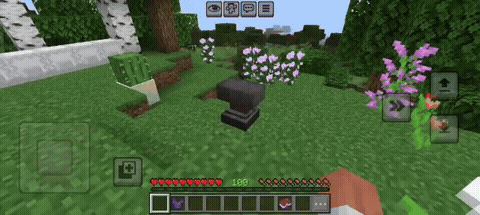

# 🔓 AnvilUncapped

A Minecraft Bedrock mod that removes Anvil Too Expensive Cap for Survival gamemode.

<table>
<tr><td>

#### *If a world without limits is what you want, a world without limits is what you get...*

</td></tr>
</table>

## ⚙️ Requirements

| 🖥️ Platform | 🛠️ Recommended Tool |
| :--- | :--- |
| 🚀 **Android** | [Ambient](https://play.google.com/store/apps/details?id=io.kitsuri.mayape) or [LeviLaunchroid](https://github.com/LiteLDev/LeviLaunchroid) |
| 🚀 **Windows Client** | [LeviLauncher](https://github.com/LiteLDev/LeviLauncher) (or any DLL injector, e.g., [FateInjector](https://github.com/fligger/FateInjector)) |
| 🚀 **Windows Server** | [LeviLamina](https://github.com/LiteLDev/LeviLamina) or any DLL injector, e.g., [FateInjector](https://github.com/fligger/FateInjector) |
